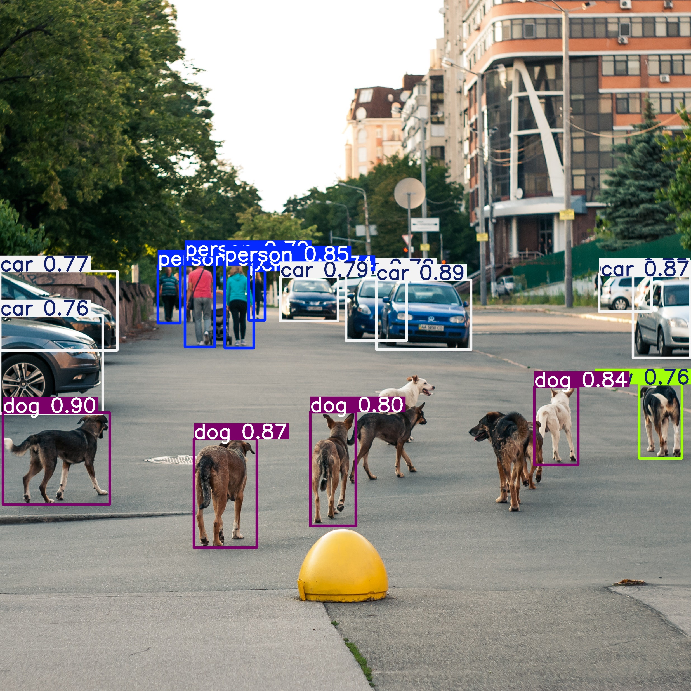
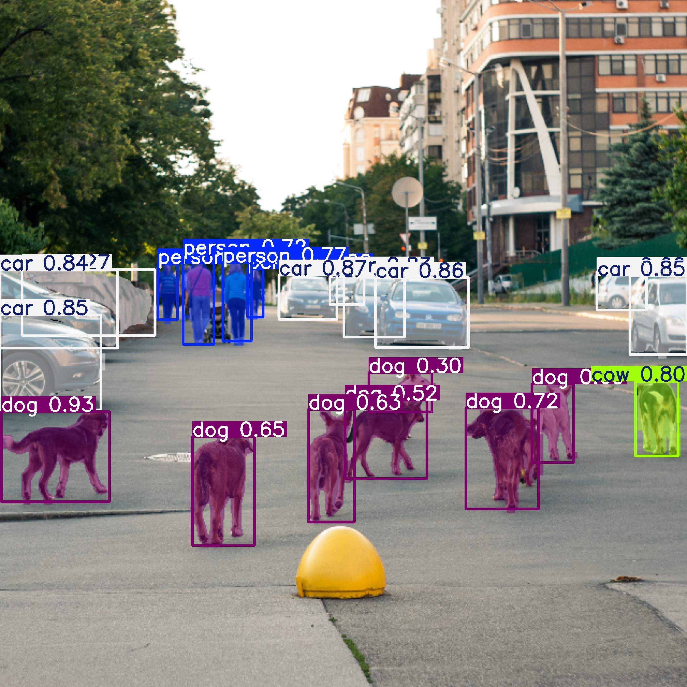
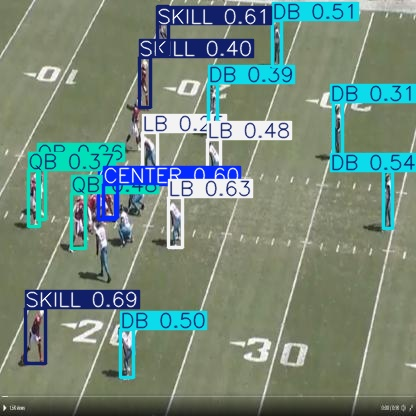
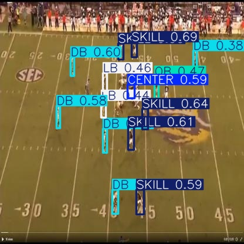

# YOLOv8 Object Detection and Semantic Segmentation Project (Working with Roboflow)

This repository contains code for object detection and segmentation using the YOLOv8 model. The project leverages Google Colab for training and inference tasks, with datasets managed via Roboflow.

## Installation

To get started, clone the repository and install the necessary dependencies:

```python
# Mount Google Drive
from google.colab import drive
drive.mount('/content/gdrive')

# Set up the project directory
ROOT_DIR = '..path to your project directory..'
%cd {ROOT_DIR}

# Clone the Ultralytics repository
!git clone https://github.com/ultralytics/ultralytics.git

# Navigate to the cloned repository
%cd ultralytics

# Install the ultralytics package
!pip install ultralytics

# Install Ipython for displaying images
!pip install Ipython
```

# Object Detection and Segmentation
Images and videos have been used for object detection and segmentation. The YOLOv8 model was applied to the Football Player dataset on the Roboflow website for just 5 epochs. Therefore, it should be applied for more epochs to achieve higher and better overall accuracy.

# Algorithms Used

- **YOLOv8 Model**: The YOLO (You Only Look Once) v8 model is used for both object detection and segmentation.
- **Image Preprocessing**: Images are preprocessed to fit the input size requirements of the YOLOv8 model.
- **Inference**: The YOLOv8 model performs inference to detect objects and segment images/videos.
- **Post-processing**: Results are post-processed to display bounding boxes and segmentation masks.

# Input and Output

### Input

- **Images**: JPG or PNG format images are used for object detection and segmentation. Example image available at `input/dogs_n_cars.jpg`.
- **Videos**: MP4 format videos are used for object detection and segmentation. Example video available at `input/test_vid.mp4`.
- **Datasets**: Custom datasets for training are managed via Roboflow. You can find the dataset [here](https://universe.roboflow.com/bronkscottema/football-player-detection).

### Output

- **Predicted Image for Object Detection**: Results from object detection are saved in the `output.zip/dogs_n_cars-detection.jpg` directory.

- **Predicted Image for Object Segmentation**: Results from object detection are saved in the `output.zip8/dogs_n_cars-segmentation.jpg` directory.

- **Training Results of Football Player Detection Coputer Vision**: Model weights and logs from training are saved in the `output.zip/football-player-detection` directory.
Two of the Detected Football Players:


